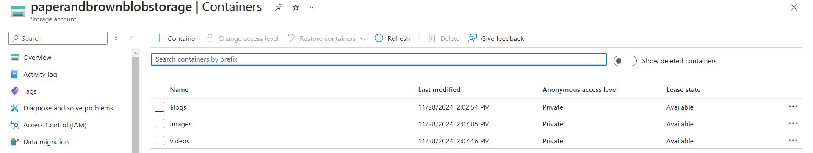

# Azure Blob Storage Project

## Overview
This project demonstrates how to use **Azure Blob Storage** for scalable file storage and management. It includes features like uploading, downloading, listing, and deleting files from Azure Blob Storage using [Azure SDK](https://learn.microsoft.com/en-us/azure/storage/blobs/).

---

## Features
- Upload files to Azure Blob Storage.
- List and retrieve files stored in blobs.
- Delete blobs securely.
- Generate Shared Access Signatures (SAS) for secure access.

---

## Technologies Used
- **Azure Blob Storage** for cloud file storage.
- **Programming Languages**: Python (or specify your language).
- **Azure SDK**: For Blob operations.
- **Tools**: Visual Studio Code, Azure Portal, Git.

---

## Prerequisites
- Azure Subscription
- Azure Storage Account
- Programming environment set up (Python, Node.js, .NET, etc.).

---

## Installation

### Clone the Repository
```bash
git https://github.com/50sphase/azure-blobstorage.git
cd azure-blob-storage-demo

## Screenshots

### Upload File


### List Files

